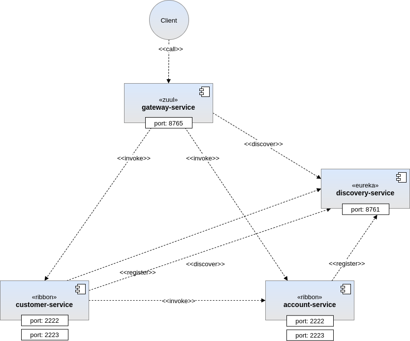

# Arquitetura de microserviços: criando microserviços usando Spring Cloud, Eureka e Zuul

## Arquitetura

A Framework Spring fornece um conjunto de bibliotecas para criar microserviços em Java. Eles são uma parte do projeto Spring Cloud. Microserviços usando o Spring Boot e as seguintes tecnologias:

**Zuul** –  serviço de gateway que fornece roteamento dinâmico, monitoramento, resiliência, segurança, ...

**Ribbon** – balanceador de carga (client side)

**Feign** – cliente declarativo REST

**Eureka** – registro e descoberta de serviços

A imagem representa a arquitetura implementada. O cliente chama o endpoint disponível dentro do serviço "customer" que armazena os dados básicos do cliente via Zuul gateway. Este endpoint interage com o serviço "account" para coletar informações sobre contas de clientes atendidas pelo endpoint do serviço "customer". Cada serviço se registra no serviço de descoberta Eureka automaticamente no arranque.

## Arranque

Utilizamos Spring Boot para facilitar a criação e o arranque dos microserviços de forma stand-alone. Para isso executar por ordem cada um dos seguintes comandos:

1. ``mvn spring-boot:run -f sandbox-spring-cloud-microservices-discovery-service/pom.xm ``

2. ``mvn spring-boot:run -f sandbox-spring-cloud-microservices-account-service/pom.xm ``

3. ``mvn spring-boot:run -f sandbox-spring-cloud-microservices-customer-service/pom.xm ``

4. ``mvn spring-boot:run -f sandbox-spring-cloud-microservices-gateway-service/pom.xm ``

## Testar

### Executar um POST para o recurso REST /accounts do serviço "account":

``curl -H "Content-Type: application/json" -X POST -d '{"customerId": 229384,"number":"account_123434"}' http://localhost:8765/api/account/accounts``

### Executar um GET para o recurso REST /accounts do serviço "account":

``curl -H "Content-Type: application/json" -X GET http://localhost:8765/api/account/accounts/1``

### Executar um POST para o recurso REST /customers do serviço "customer":

``curl -H "Content-Type: application/json" -X POST -d '{ "pesel": "pesel_1232323", "name": "Customer Name", "type": "INDIVIDUAL", "account": { "customerId": 1, "number": "account_123" } }' http://localhost:8765/api/customer/customers``

### Executar um GET para o recurso REST /customers do serviço "customer":

``curl -H "Content-Type: application/json" -X GET http://localhost:8765/api/customer/customers/1``

### Executar um GET para o recurso REST /customers/accounts do serviço "customer":

``curl -H "Content-Type: application/json" -X GET http://localhost:8765/api/customer/customers/accounts/229384``

